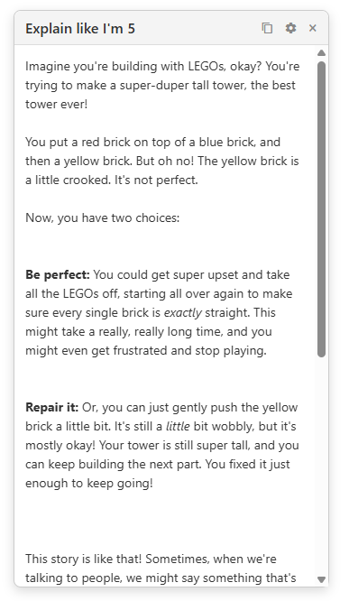

# eli5-chrome-ext-gemini

Explain like I'm 5 Chrome Extension

## Overview
The `eli5-chrome-ext-gemini` extension is designed to simplify complex text by providing easy-to-understand explanations. With just a few clicks, you can get a concise and clear explanation of any selected text on a webpage, making it perfect for students, researchers, or anyone looking to understand complex topics quickly.

## Features
- **Context Menu Integration**: Right-click on any selected text and choose "Explain Like I'm 5" to get an explanation.
- **Draggable Explanation Box**: The explanation box can be moved around the screen for better usability.
- **Copy Explanation**: Easily copy the generated explanation to your clipboard.
- **API Key Configuration**: Configure your API key for the generative language model directly from the extension options.

## How to Use
1. **Install the Extension**: Add the extension to your Chrome browser.
2. **Set Up API Key**:
   - On first use, the extension will prompt you to configure your API key.
   - Navigate to the options page and enter your API key for the generative language model.
3. **Select Text**:
   - Highlight any text on a webpage.
   - Right-click and select "Explain Like I'm 5" from the context menu.
4. **View Explanation**:
   - An explanation box will appear with the simplified explanation.

   

5. **Additional Actions**:
   - Drag the explanation box to reposition it on the screen.
   - Use the copy button to copy the explanation to your clipboard.
   - Access the settings button to reconfigure your API key if needed.

## How to Create a Gemini API Token
1. **Sign In to Google AI Studio**:
   - Visit [Google AI Studio](https://aistudio.google.com/).
   - Sign in with your Google account.

2. **Create a New Project**:
   - Click on the project dropdown in the top navigation bar.
   - Select "New Project" and provide a name for your project.
   - Click "Create" to finalize the project setup.

3. **Enable the Gemini API**:
   - Navigate to the "APIs & Services" section in the left-hand menu.
   - Click on "Enable APIs and Services."
   - Search for "Gemini API" and enable it for your project.

4. **Create an API Key**:
   - Go to the "Credentials" tab under "APIs & Services."
   - Click on "Create Credentials" and select "API Key."
   - Copy the generated API key.

5. **Restrict the API Key (Optional)**:
   - For security, restrict the API key to specific IP addresses or APIs.
   - Click on the "Edit" icon next to your API key and configure restrictions as needed.

6. **Save the API Key**:
   - Use this API key in the extension options page to configure the extension.

## How to Install the Extension Locally
Since the extension is not yet available in the Chrome Web Store, you can install it locally in developer mode by following these steps:

1. **Clone or Download the Repository**:
   - Clone this repository to your local machine or download it as a ZIP file and extract it.

2. **Build the Extension**:
   - Open a terminal in the project directory.
   - Run the following command to build the extension:
     ```bash
     npm run build
     ```
   - This will generate the production-ready files in the `dist` directory.

3. **Open Chrome Extensions Page**:
   - Open Google Chrome and navigate to `chrome://extensions/`.

4. **Enable Developer Mode**:
   - In the top-right corner of the Extensions page, toggle the "Developer mode" switch to enable it.

5. **Load Unpacked Extension**:
   - Click on the "Load unpacked" button.
   - Select the `dist` directory where the built files are located.

6. **Verify Installation**:
   - The extension should now appear in the list of installed extensions.
   - You can pin it to the toolbar for easy access.

7. **Set Up API Key**:
   - Follow the instructions in the "How to Use" section to configure your API key.

## Notes
- Ensure you have a valid API key for the generative language model.
- The extension requires permissions to access the selected text and display the explanation box.

Enjoy simplifying complex topics with `eli5-chrome-ext-gemini`!
